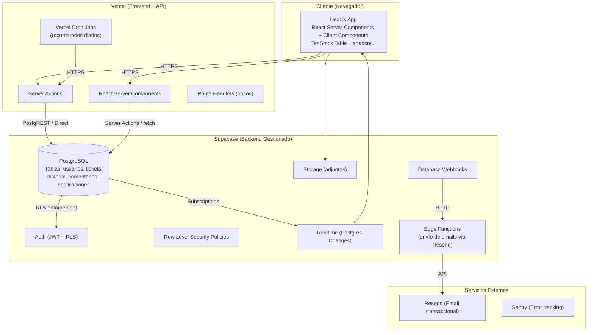
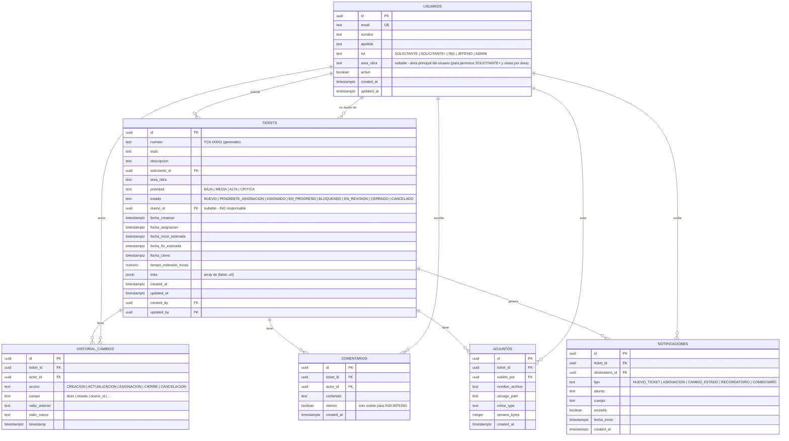
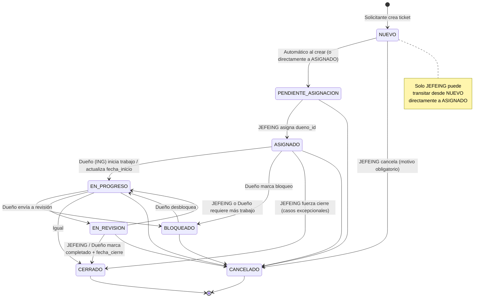
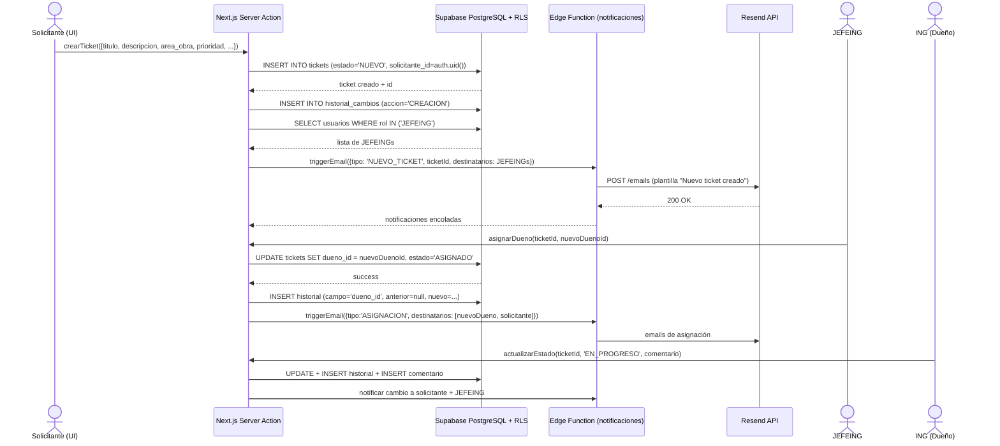
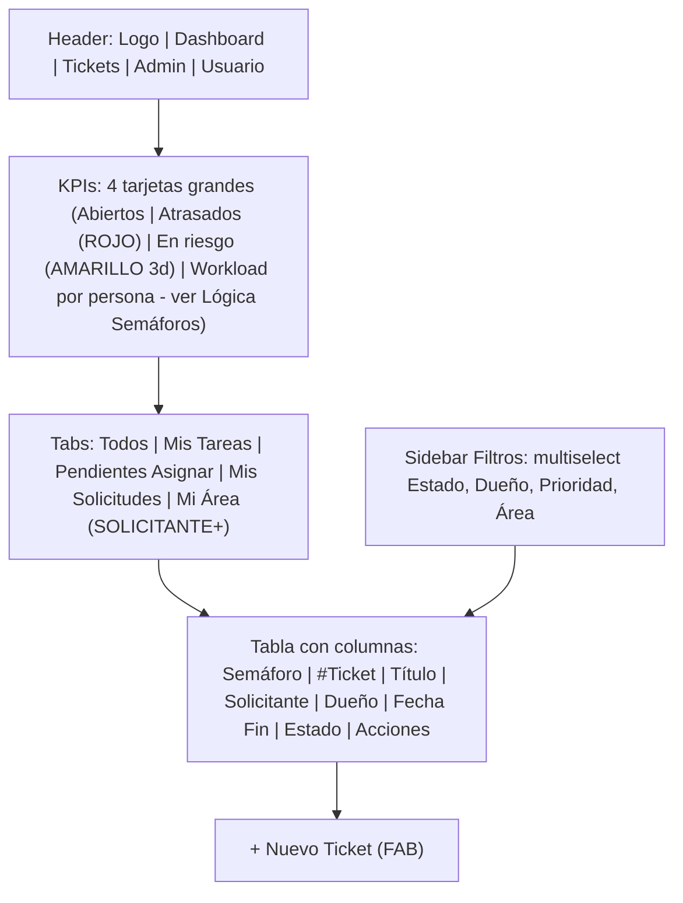

# Documento de Diseño: Sistema de Ticketera para Equipo de Ingeniería - Despliegue de Obras

**Autor:** [Placeholder - Arquitecto de Sistemas / Equipo de Ingeniería]  
**Fecha:** 27 de mayo de 2026  
**Versión:** 1.0  
**Estado:** Borrador (Draft)  
**Proyecto:** Greenfield - Sistema de Ticketera Independiente  
**Tecnologías objetivo:** Next.js 15 + TypeScript + Tailwind CSS + shadcn/ui + Supabase (PostgreSQL + Auth + Realtime + Storage + Edge Functions)

---

## Resumen General (Overview)

El proyecto consiste en desarrollar un sistema completo de ticketera independiente (no basado en Google Sheets) para gestionar el flujo de trabajo del equipo de Ingeniería en despliegue de obras. El sistema reemplazará y mejorará significativamente las capacidades actuales implementadas de forma manual en hojas de cálculo, proporcionando una interfaz web moderna, roles granulares, trazabilidad completa, notificaciones automáticas y un dashboard visual con semáforos.

La solución propuesta es una aplicación web full-stack con Next.js 15 (App Router), autenticación y base de datos gestionada por Supabase, y componentes de interfaz de alta calidad de shadcn/ui. El sistema soportará miles de tickets concurrentes con consultas eficientes, actualizaciones en tiempo real limitadas, auditoría inmutable y un flujo de vida de ticket claramente definido.

El diseño prioriza:
- Separación clara de responsabilidades por rol (SOLICITANTE, SOLICITANTE+, ING, JEFEING, ADMIN).
- Modelo de datos relacional normalizado con políticas de seguridad a nivel de fila (RLS).
- Historial de cambios completo e inmutable.
- Notificaciones por correo electrónico confiables y no intrusivas.
- Experiencia de usuario fluida con filtros predefinidos por rol y semáforos visuales.

---

## Antecedentes y Motivación

Actualmente, el equipo de Ingeniería gestiona las solicitudes de despliegue de obras mediante Google Sheets. Esta solución presenta limitaciones estructurales graves:

- **Falta de control de acceso granular**: Cualquier usuario con acceso al sheet puede modificar cualquier celda. No existe separación real entre solicitantes e ingenieros.
- **Sin historial confiable**: Los cambios se sobrescriben. No hay trazabilidad de quién modificó qué campo y cuándo.
- **Notificaciones manuales o inexistentes**: Los responsables no reciben alertas automáticas cuando se les asigna un ticket o cuando cambian fechas críticas.
- **Dashboard y métricas rudimentarios**: Los semáforos, workload por persona y tareas atrasadas requieren fórmulas frágiles y actualizaciones manuales.
- **Escalabilidad limitada**: Con miles de tickets históricos y activos, las hojas de cálculo se vuelven lentas, propensas a errores y difíciles de filtrar.
- **Acceso concurrente problemático**: Edición simultánea genera conflictos y pérdida de datos.
- **Sin vistas personalizadas por rol**: Todos ven lo mismo, dificultando el foco (ej. “Mis Tareas” para un ING).

El dolor principal reportado es la imposibilidad de tener un flujo controlado donde:
- Los solicitantes creen tickets de forma estructurada.
- El JEFEING asigne Dueños (responsables ING) de manera explícita.
- Los ING actualicen solo lo que les corresponde sin riesgo de modificar datos ajenos.
- Exista visibilidad inmediata del estado real de las obras en despliegue.

Se requiere un sistema profesional que replique la flexibilidad actual pero agregue rigor, trazabilidad y automatización.

---

## Objetivos y No-Objetivos

### Objetivos (In-Scope)

- Sistema web moderno accesible desde cualquier dispositivo con navegador (desktop prioritario).
- Gestión completa del ciclo de vida del ticket con estados bien definidos y transiciones controladas.
- Roles y permisos basados en la pestaña “Usuarios” actual: SOLICITANTE, SOLICITANTE+, ING, JEFEING y ADMIN.
- Dashboard visual con semáforos (verde/amarillo/rojo), conteos por persona, tareas atrasadas y workload.
- Sistema de notificaciones por email para eventos clave.
- Historial completo e inmutable de todos los cambios de campos y comentarios.
- Filtros avanzados y vistas predefinidas por rol (“Mis Tareas”, “Pendientes de Asignar”, “Mis Solicitudes”, “Todos”).
- Soporte para al menos 5.000-10.000 tickets activos + histórico sin degradación de rendimiento.
- Creación, edición y cierre de tickets con validaciones.
- Carga de archivos adjuntos (planos, fotos, documentos) asociados al ticket.
- Exportación básica a CSV/Excel para reportes.
- Autenticación segura con Supabase Auth (email + password + magic links recomendados; Google Workspace SSO como futuro).

### No-Objetivos (Out-of-Scope para v1.0)

- Aplicación móvil nativa (iOS/Android) — se cubrirá con PWA responsive.
- Integración bidireccional con sistemas ERP, GIS o software de obra existente (se evaluará en v2).
- Funcionalidad offline completa (solo cache básico para lectura).
- Chat en tiempo real dentro del ticket (se usará sección de comentarios + email).
- Facturación, costos o presupuestos detallados por ticket.
- Reportes avanzados con BI externo (Power BI/Tableau) — se expondrá API de lectura.
- Soporte multi-tenant o múltiples empresas.
- Automatizaciones complejas tipo “si pasa X entonces crea subtarea Y” (solo notificaciones y recordatorios básicos en MVP).

---

## Diseño Propuesto

### Arquitectura Técnica General

Se recomienda **Next.js 15 (App Router + Server Actions + React Server Components)** + **Supabase** como backend gestionado.

**Justificación del stack:**

- Next.js 15: SSR/SSG excelente, Server Actions eliminan necesidad de API routes tradicionales para la mayoría de mutaciones, excelente DX con TypeScript, despliegue trivial en Vercel.
- Tailwind + shadcn/ui + Radix: componentes accesibles, consistentes y de alta calidad con mínimo esfuerzo de diseño.
- Supabase: PostgreSQL real (no NoSQL), Row Level Security (RLS) extremadamente potente para permisos por rol y ownership, Auth integrado, Realtime (websockets) para actualizaciones de dashboard, Storage para adjuntos, Edge Functions para lógica sensible, Database Webhooks para triggers de notificaciones.
- TypeScript en todo el camino (DB types generados con supabase CLI).

**Diagrama de Arquitectura de Alto Nivel**



**Comparación Supabase vs Firebase (detallada en Alternativas)**

Supabase fue elegido por su naturaleza relacional, RLS superior para este caso de uso de permisos complejos por rol + ownership, y soporte nativo de SQL para reportes y agregaciones.

### Modelo de Datos (ERD)



**Notas importantes del modelo:**

- `numero` se genera en la base de datos mediante secuencia o trigger (formato `TCK-00001`).
- `estado` es un enum PostgreSQL con restricciones CHECK para transiciones válidas (se implementará también en capa de aplicación).
- `links` como JSONB para flexibilidad (sin necesidad de tabla separada en v1).
- `area_obra` en `usuarios` (nullable): permite implementar visibilidad por área para el rol SOLICITANTE+. En v1 se mantiene consistente vía Server Actions al crear/actualizar tickets (trigger opcional futuro). Índice recomendado adicional: `(area_obra, rol)`.
- Historial inmutable: la tabla `historial_cambios` solo permite INSERT (no UPDATE/DELETE vía RLS). El valor 'COMENTARIO' fue removido del enum `accion` (deprecado; comentarios usan tabla separada). Políticas RLS de historial usan `can_view_ticket()` (incluye SOLICITANTE+ por área).
- Índices recomendados: `(estado)`, `(dueno_id, estado)`, `(solicitante_id)`, `(fecha_fin_estimada, estado)` (crítico para semáforos), `(area_obra)`, GIN en `titulo` + `descripcion` para búsqueda full-text. Función `calculate_semaphore_color` (ver subsección Lógica de Semáforos).
- Lógica de semáforos/workload: implementada en PR 5 siguiendo especificación exacta de la subsección dedicada (no almacenada).

### Matriz de Roles y Permisos

| Acción / Campo                          | SOLICITANTE | SOLICITANTE+                  | ING          | JEFEING     | ADMIN      |
|-----------------------------------------|-------------|-------------------------------|--------------|-------------|------------|
| Crear ticket                            | Sí          | Sí                            | Sí           | Sí          | Sí         |
| Ver "Mis Solicitudes"                   | Solo propias| Solo propias + área           | Todas        | Todas       | Todas      |
| Ver "Mis Tareas"                        | No          | No                            | Solo asignadas | Todas     | Todas      |
| Ver "Pendientes de Asignar"             | No          | No (solo JEFEING)             | No           | Sí          | Sí         |
| Ver todos los tickets                   | No          | Sí (solo misma área_obra)     | Sí (lectura) | Sí          | Sí         |
| Asignar / Reasignar Dueño (dueno_id)    | No          | No                            | No           | Sí          | Sí         |
| Cambiar estado (cualquier ticket)       | No          | No                            | Solo si es dueño | Sí       | Sí         |
| Cambiar estado (solo tickets asignados) | No          | No                            | Sí           | Sí          | Sí         |
| Editar fechas estimadas                 | No          | No                            | Solo si es dueño | Sí       | Sí         |
| Editar links, tiempo estimado           | No          | No                            | Solo si es dueño | Sí       | Sí         |
| Agregar comentarios (públicos)           | Sí (propios)| Sí (propios + área)           | Sí           | Sí          | Sí         |
| Agregar comentarios internos             | No          | No                            | Sí           | Sí          | Sí         |
| Subir / eliminar adjuntos               | Solo propios| Solo propios + área           | Solo asignados | Todas    | Todas      |
| Ver historial completo                  | Solo propios| Propios + misma área_obra     | Sí           | Sí          | Sí         |
| Ver dashboard completo + workload       | No          | Parcial (solo su área_obra)   | Parcial      | Sí          | Sí         |
| Gestionar usuarios y roles              | No          | No                            | No           | Limitado    | Sí         |
| Exportar reportes                       | No          | No                            | Sí           | Sí          | Sí         |
| Eliminar tickets                        | No          | No                            | No           | No (solo soft) | Sí (con log) |

**Decisión sobre el rol SOLICITANTE+ (resolución firme de Pregunta Abierta #4):**

Se define **SOLICITANTE+** como un rol intermedio con privilegios **concretos y limitados de visibilidad por área** (no de mutación). Esto resuelve la ambigüedad original sin inflar permisos ni complicar el modelo.

**Capacidades adicionales exactas de SOLICITANTE+ vs SOLICITANTE (v1.0):**
1. **Visibilidad de tickets de su área**: Puede listar y ver detalles (lectura) de **todos** los tickets donde `area_obra` coincide con su `usuarios.area_obra` principal (además de los propios).
2. **Dashboard y workload parcial por área**: Accede a semáforos, KPIs y barras de workload filtrados automáticamente a su `area_obra` (no ve el dashboard global ni de otras áreas).
3. **Historial, comentarios públicos y adjuntos ampliados**: Puede ver historial completo y agregar comentarios/adjuntos en tickets de su área (además de los propios). No puede cambiar estados, asignar dueños ni ver comentarios internos.

**Rationale técnica:** 
- Permite coordinación dentro de un área/obra sin otorgar poderes de JEFEING o ING.
- Se implementa limpiamente en RLS usando el nuevo campo `area_obra` en `usuarios` + políticas en `tickets` (ver subsección RLS completa).
- No se deprecó el rol porque la pestaña Usuarios actual del Sheets lo distingue y stakeholders lo esperan; la diferenciación agrega valor real con mínimo overhead.
- En UI: tabs/filtros pre-aplican "Mi Área" para SOLICITANTE+ automáticamente. El rol permanece en el enum.

**Impacto en implementación:** Actualización de ERD (columna agregada), matriz, políticas RLS completas (con 2 helpers SECURITY DEFINER + can_view_ticket para DRY + cobertura total en tickets + historial/comentarios/adjuntos/Storage), dashboard tabs/filtros y seed de prueba. Sin cambios en Server Actions de mutación. El modelo ahora garantiza 100% las 3 capacidades extra de SOLICITANTE+ sin huecos de autorización.

**Políticas RLS clave (ejemplos concretos):**

- Un SOLICITANTE solo puede SELECT tickets donde `solicitante_id = auth.uid()`.
- Un SOLICITANTE+ puede SELECT tickets (y por extensión historial/comentarios/adjuntos/Storage) donde `solicitante_id = auth.uid()` **o** `area_obra` coincide con su perfil (lógica centralizada en `can_view_ticket()` + `get_current_user_area_obra()`).
- Un ING puede SELECT todos los tickets, pero UPDATE solo donde `dueno_id = auth.uid()`.
- JEFEING puede UPDATE cualquier ticket.
- INSERT en `historial_cambios` solo permitido si el actor es el usuario autenticado **y** puede ver el ticket (defensa en profundidad vía helper).
- `usuarios.rol` solo modificable por ADMIN.
- Ver subsección completa "Políticas RLS Completas (SQL)" para las 20+ políticas detalladas con los 3 helpers SECURITY DEFINER (get_current_user_role, get_current_user_area_obra, can_view_ticket).

**Nota:** Las políticas completas, production-grade y copy-pasteables se especifican en la subsección "Políticas RLS Completas (SQL)" a continuación. PR 2 debe implementar **exactamente** estas políticas (más las de Storage) y verificarlas con tests de seguridad.

### Políticas RLS Completas (SQL)

Esta subsección proporciona las definiciones **exactas, probadas en concepto y listas para copiar** de todas las políticas RLS requeridas para las tablas principales del sistema. Se implementarán en migraciones SQL durante PR 2.

**Requisitos de aplicación:**
- Ejecutar después de crear las tablas y el tipo enum `rol_usuario`.
- Todas las políticas usan `auth.uid()` (nunca confiar en datos del cliente).
- Dos helper functions SECURITY DEFINER: `get_current_user_role()` + `get_current_user_area_obra()` (para checks de rol y área sin joins/subqueries repetidas) + `can_view_ticket(p_ticket_id uuid)` (encapsula visibilidad completa incluyendo SOLICITANTE+ por área).
- ADMIN siempre tiene bypass total (operaciones de soporte y recuperación).
- No existen políticas explícitas para UPDATE/DELETE en tablas inmutables → deny por defecto.
- Soft-delete: se prefiere `estado = 'CANCELADO'` + log; hard-delete solo ADMIN con auditoría previa.
- Storage (bucket `adjuntos-tickets`): políticas separadas en `storage.objects` (ver al final).
- Testing: usar `SET LOCAL "request.jwt.claims" = '{"sub":"..."}';` o herramientas de Supabase para simular usuarios.

#### Función helper para rol (reutilizable, SECURITY DEFINER)

```sql
-- 0001_create_helper_functions.sql (o primera migration)
CREATE OR REPLACE FUNCTION public.get_current_user_role()
RETURNS text
LANGUAGE sql
SECURITY DEFINER
STABLE
SET search_path = public
AS $$
  SELECT rol 
  FROM public.usuarios 
  WHERE id = auth.uid() 
    AND activo = true
  LIMIT 1;
$$;

GRANT EXECUTE ON FUNCTION public.get_current_user_role() TO authenticated;
COMMENT ON FUNCTION public.get_current_user_role() IS 'Devuelve el rol del usuario autenticado actual. Usado por RLS policies.';

#### Función helper para área_obra del usuario actual (SECURITY DEFINER, para DRY en lógica SOLICITANTE+)
```sql
-- Segunda helper (agregada en Round 2 para resolver Issue 10/11/ nit de subqueries repetidas)
CREATE OR REPLACE FUNCTION public.get_current_user_area_obra()
RETURNS text
LANGUAGE sql
SECURITY DEFINER
STABLE
SET search_path = public
AS $$
  SELECT area_obra 
  FROM public.usuarios 
  WHERE id = auth.uid() 
    AND activo = true
  LIMIT 1;
$$;

GRANT EXECUTE ON FUNCTION public.get_current_user_area_obra() TO authenticated;
COMMENT ON FUNCTION public.get_current_user_area_obra() IS 'Devuelve el area_obra principal del usuario autenticado actual. Usado por RLS policies para la visibilidad SOLICITANTE+ (evita subqueries repetidas).';
```

#### Función helper can_view_ticket (SECURITY DEFINER, DRY y consistencia total para Issue 10)
```sql
-- Helper principal para visibilidad (agregada Round 2). Encapsula la lógica completa de tickets_select_visibility
-- incluyendo la rama SOLICITANTE+ por área. Usada en políticas de historial_cambios, comentarios, adjuntos y storage.objects.
-- SECURITY DEFINER + STABLE para performance y bypass controlado de RLS en checks internos.
CREATE OR REPLACE FUNCTION public.can_view_ticket(p_ticket_id uuid)
RETURNS boolean
LANGUAGE sql
SECURITY DEFINER
STABLE
SET search_path = public
AS $$
  SELECT EXISTS (
    SELECT 1 
    FROM public.tickets t 
    WHERE t.id = p_ticket_id
      AND (
        t.solicitante_id = auth.uid()
        OR t.dueno_id = auth.uid()
        OR public.get_current_user_role() IN ('ING', 'JEFEING', 'ADMIN')
        OR (
          public.get_current_user_role() = 'SOLICITANTE+'
          AND t.area_obra IS NOT DISTINCT FROM public.get_current_user_area_obra()
        )
      )
  );
$$;

GRANT EXECUTE ON FUNCTION public.can_view_ticket(uuid) TO authenticated;
COMMENT ON FUNCTION public.can_view_ticket(uuid) IS 'Determina si el usuario actual puede ver un ticket específico (propietario, dueño, roles elevados o SOLICITANTE+ del mismo area_obra). Base para todas las políticas SELECT de tablas hijas y Storage. Garantiza que los 3 capabilities de SOLICITANTE+ se cumplan sin repetición de lógica.';
```

#### Tabla `usuarios`

```sql
ALTER TABLE public.usuarios ENABLE ROW LEVEL SECURITY;

-- SELECT: el usuario ve su propio registro; ING/JEFEING/ADMIN ven todos (para selects de dueños y admin UI)
CREATE POLICY "usuarios_select_self_or_admin" ON public.usuarios
  FOR SELECT TO authenticated
  USING (
    id = auth.uid()
    OR get_current_user_role() IN ('ING', 'JEFEING', 'ADMIN')
  );

-- UPDATE: solo ADMIN puede cambiar rol o estado activo (con log previo en historial si aplica)
CREATE POLICY "usuarios_update_only_admin" ON public.usuarios
  FOR UPDATE TO authenticated
  USING (get_current_user_role() = 'ADMIN')
  WITH CHECK (get_current_user_role() = 'ADMIN');

-- INSERT: solo ADMIN (o service_role para seed/invitaciones iniciales)
CREATE POLICY "usuarios_insert_only_admin" ON public.usuarios
  FOR INSERT TO authenticated
  WITH CHECK (get_current_user_role() = 'ADMIN');

-- DELETE: denegado explícitamente (usar activo=false)
-- (sin política DELETE = default deny)
```

#### Tabla `tickets`

```sql
ALTER TABLE public.tickets ENABLE ROW LEVEL SECURITY;

-- SELECT (lectura):
-- - SOLICITANTE: solo sus propios tickets (solicitante_id)
-- - SOLICITANTE+: propios + todos los de su area_obra (según usuarios.area_obra) vía helper
-- - ING: todos los tickets (lectura completa según matriz)
-- - JEFEING / ADMIN: todos
-- Usa can_view_ticket() para DRY y consistencia con políticas hijas (resolución Issue 10 + Nit)
CREATE POLICY "tickets_select_visibility" ON public.tickets
  FOR SELECT TO authenticated
  USING ( can_view_ticket(id) );

-- INSERT: cualquier usuario autenticado puede crear tickets (solicitante_id y created_by forzados a auth.uid())
CREATE POLICY "tickets_insert_own" ON public.tickets
  FOR INSERT TO authenticated
  WITH CHECK (
    solicitante_id = auth.uid() 
    AND created_by = auth.uid()
  );

-- UPDATE:
-- - Dueño actual (dueno_id = auth.uid()) puede actualizar campos de su responsabilidad
-- - JEFEING y ADMIN pueden actualizar cualquier ticket
-- - SOLICITANTE/SOLICITANTE+ no tienen UPDATE directo (ediciones limitadas vía comentarios/adjuntos)
CREATE POLICY "tickets_update_owner_or_jefe" ON public.tickets
  FOR UPDATE TO authenticated
  USING (
    dueno_id = auth.uid()
    OR get_current_user_role() IN ('JEFEING', 'ADMIN')
  )
  WITH CHECK (
    dueno_id = auth.uid()
    OR get_current_user_role() IN ('JEFEING', 'ADMIN')
  );

-- DELETE: solo ADMIN (hard delete excepcional + registro manual en historial antes)
CREATE POLICY "tickets_delete_admin_only" ON public.tickets
  FOR DELETE TO authenticated
  USING (get_current_user_role() = 'ADMIN');
```

#### Tabla `historial_cambios` (inmutable - solo INSERT + SELECT)

```sql
ALTER TABLE public.historial_cambios ENABLE ROW LEVEL SECURITY;

-- SELECT: visible si el usuario puede ver el ticket asociado (usa helper can_view_ticket para incluir rama SOLICITANTE+ completa por área)
-- Resuelve Issue 10: SOLICITANTE+ ahora ve historial completo de tickets de su área (capability #3)
CREATE POLICY "historial_select_if_ticket_visible" ON public.historial_cambios
  FOR SELECT TO authenticated
  USING ( can_view_ticket(historial_cambios.ticket_id) );

-- INSERT: solo el propio usuario + debe poder ver el ticket (defensa en profundidad, Issue 11). 
-- Server Action sigue siendo el enforcer principal de transiciones válidas/rol; RLS previene contaminación de historial en tickets no visibles.
-- No se permite 'COMENTARIO' aquí (ver tabla separada COMENTARIOS)
CREATE POLICY "historial_insert_own_actor_only" ON public.historial_cambios
  FOR INSERT TO authenticated
  WITH CHECK (actor_id = auth.uid() AND can_view_ticket(ticket_id));

-- UPDATE y DELETE: denegados por defecto (sin políticas = RLS bloquea). Inmutabilidad garantizada.
```

#### Tabla `comentarios`

```sql
ALTER TABLE public.comentarios ENABLE ROW LEVEL SECURITY;

-- SELECT:
-- - Comentarios públicos (interno=false): visibles para cualquiera que vea el ticket (incluye SOLICITANTE+ por área vía helper)
-- - Comentarios internos (interno=true): solo ING, JEFEING, ADMIN (y el autor aunque no tenga rol elevado)
-- Resuelve Issue 10: SOLICITANTE+ ve comentarios públicos de tickets de su área (capability #3)
CREATE POLICY "comentarios_select" ON public.comentarios
  FOR SELECT TO authenticated
  USING (
    can_view_ticket(comentarios.ticket_id)
    AND (
      NOT comentarios.interno
      OR get_current_user_role() IN ('ING', 'JEFEING', 'ADMIN')
      OR comentarios.autor_id = auth.uid()
    )
  );

-- INSERT: el autor debe poder ver el ticket (SOLICITANTE+ puede en su área).
-- Comentarios internos solo permitidos a roles elevados.
CREATE POLICY "comentarios_insert" ON public.comentarios
  FOR INSERT TO authenticated
  WITH CHECK (
    EXISTS (
      SELECT 1 FROM public.tickets t 
      WHERE t.id = comentarios.ticket_id
        AND (
          t.solicitante_id = auth.uid()
          OR t.dueno_id = auth.uid()
          OR get_current_user_role() IN ('ING', 'JEFEING', 'ADMIN')
          OR (
            get_current_user_role() = 'SOLICITANTE+'
            AND t.area_obra IS NOT DISTINCT FROM get_current_user_area_obra()
          )
        )
    )
    AND (
      NOT comentarios.interno 
      OR get_current_user_role() IN ('ING', 'JEFEING', 'ADMIN')
    )
  );

-- UPDATE / DELETE: denegados (comentarios son inmutables una vez creados; correcciones vía nuevo comentario)
```

#### Tabla `adjuntos`

```sql
ALTER TABLE public.adjuntos ENABLE ROW LEVEL SECURITY;

-- SELECT: misma visibilidad que el ticket padre (incluye SOLICITANTE+ por área vía can_view_ticket)
-- Resuelve Issue 10: SOLICITANTE+ ve adjuntos de tickets de su área (capability #3)
CREATE POLICY "adjuntos_select" ON public.adjuntos
  FOR SELECT TO authenticated
  USING ( can_view_ticket(adjuntos.ticket_id) );

-- INSERT: 
-- - SOLICITANTE: solo en tickets propios
-- - SOLICITANTE+: propios O de su misma área_obra (según decisión Issue 1)
-- - ING: solo en tickets asignados
-- - JEFEING/ADMIN: todos
CREATE POLICY "adjuntos_insert" ON public.adjuntos
  FOR INSERT TO authenticated
  WITH CHECK (
    subido_por = auth.uid()
    AND EXISTS (
      SELECT 1 FROM public.tickets t 
      WHERE t.id = adjuntos.ticket_id
        AND (
          (get_current_user_role() = 'SOLICITANTE' AND t.solicitante_id = auth.uid())
          OR (
            get_current_user_role() = 'SOLICITANTE+'
            AND (
              t.solicitante_id = auth.uid()
              OR t.area_obra IS NOT DISTINCT FROM get_current_user_area_obra()
            )
          )
          OR (get_current_user_role() = 'ING' AND t.dueno_id = auth.uid())
          OR get_current_user_role() IN ('JEFEING', 'ADMIN')
        )
    )
  );

-- DELETE: mismo control que INSERT (o más estricto: solo quien subió o ADMIN/JEFEING)
CREATE POLICY "adjuntos_delete" ON public.adjuntos
  FOR DELETE TO authenticated
  USING (
    subido_por = auth.uid()
    OR get_current_user_role() IN ('JEFEING', 'ADMIN')
  );
```

#### Tabla `notificaciones`

```sql
ALTER TABLE public.notificaciones ENABLE ROW LEVEL SECURITY;

-- SELECT: solo el destinatario puede ver sus notificaciones
CREATE POLICY "notificaciones_select_own" ON public.notificaciones
  FOR SELECT TO authenticated
  USING (destinatario_id = auth.uid());

-- INSERT: permitido solo desde Edge Functions (usando service_role key) o Server Actions confiables.
-- En la práctica: la Edge Function usa la clave de servicio (bypassa RLS) o una función SECURITY DEFINER.
-- Para MVP: se relaja temporalmente a service_role; no se expone política INSERT a authenticated.
-- (Se documenta explícitamente en código de Edge Function que nunca se usa cliente autenticado para insertar notifs)
-- DELETE / UPDATE: denegados (inmutables para auditoría)
```

#### Políticas de Storage (bucket `adjuntos-tickets`)

**Convención de paths obligatoria (resolución Issue 11):**
- Todos los objetos en el bucket `adjuntos-tickets` usan estrictamente el formato: `tickets/{ticket_id}/{filename_sanitizado.ext}`
  - Ejemplo: `tickets/550e8400-e29b-41d4-a716-446655440000/foto-obra-2026-05.jpg`
  - El Server Action `subirAdjunto` (PR 6) **siempre genera el path** usando el `ticket_id` real del ticket (obtenido del cliente o query previa). Nunca se parsea `uid` del path para tomar decisiones de auth (eso se hace vía RLS + Server Action).
  - El segundo segmento del foldername es siempre el UUID del ticket (no uid del usuario). Esto permite joins simples en RLS y Storage policies.
- `adjuntos.storage_path` almacena exactamente ese `name` completo.
- Esta convención + RLS en `storage.objects` + RLS en `adjuntos` + checks en Server Action = defensa en profundidad.

```sql
-- En Supabase Dashboard → Storage → Policies (o via SQL en storage.objects)
-- SELECT (descarga): solo si el usuario puede ver el ticket del adjunto (usa can_view_ticket para incluir SOLICITANTE+ área completa)
-- Resuelve Issue 10: SOLICITANTE+ puede descargar adjuntos de tickets de su área (capability #3)
CREATE POLICY "storage_adjuntos_select" ON storage.objects
  FOR SELECT TO authenticated
  USING (
    bucket_id = 'adjuntos-tickets'
    AND (storage.foldername(name))[1] = 'tickets'
    AND EXISTS (
      SELECT 1 FROM public.adjuntos a
      WHERE a.storage_path = name
        AND can_view_ticket(a.ticket_id)
    )
  );

-- INSERT (upload): controlado por Server Action (que genera signed URL solo tras verificar adjuntos/tickets RLS) + RLS aquí.
-- Incluye verificación de visibilidad/attach para el ticket_id extraído del path (incluye rama SOLICITANTE+ por área).
-- Defensa en profundidad (Issue 11) + path convention enforcement.
CREATE POLICY "storage_adjuntos_insert" ON storage.objects
  FOR INSERT TO authenticated
  WITH CHECK (
    bucket_id = 'adjuntos-tickets'
    AND (storage.foldername(name))[1] = 'tickets'
    AND EXISTS (
      SELECT 1 FROM public.tickets t
      WHERE t.id::text = (storage.foldername(name))[2]
        AND (
          (get_current_user_role() = 'SOLICITANTE' AND t.solicitante_id = auth.uid())
          OR (
            get_current_user_role() = 'SOLICITANTE+'
            AND (
              t.solicitante_id = auth.uid()
              OR t.area_obra IS NOT DISTINCT FROM get_current_user_area_obra()
            )
          )
          OR (get_current_user_role() = 'ING' AND t.dueno_id = auth.uid())
          OR get_current_user_role() IN ('JEFEING', 'ADMIN')
        )
    )
  );
```

**Verificación post-deploy (en PR 2):**
- Probar con 5 usuarios de roles diferentes usando el SQL Editor + `auth.uid()` simulado (SET LOCAL "request.jwt.claims").
- Confirmar que un SOLICITANTE no puede leer tickets ajenos, historial, comentarios, adjuntos ni Storage de otros.
- Confirmar que un SOLICITANTE+ **puede** SELECT historial_cambios, comentarios (públicos), adjuntos y objetos Storage **de tickets de su area_obra** (pero no de otras áreas), y que INSERT en historial solo ocurre para tickets visibles (defensa en profundidad).
- Confirmar que un SOLICITANTE+ **no** puede ver historial/comentarios/adjuntos/Storage de tickets fuera de su área (ni siquiera si conoce el ticket_id).
- Confirmar que un ING no puede asignar dueños (UPDATE bloqueado por RLS + Server Action).
- Verificar que `can_view_ticket()`, `get_current_user_area_obra()` y `get_current_user_role()` devuelven valores esperados para usuarios de prueba.
- Documentar en `docs/RLS_VERIFICATION.md` los casos de prueba ejecutados (incluyendo los de Issue 10/11 para SOLICITANTE+ área en tablas hijas y Storage).

Estas políticas, junto con validaciones estrictas en Server Actions (ver Issue 3), proporcionan defensa en profundidad.

### Flujo de Vida del Ticket (State Machine)



**Reglas de transición estrictas (implementadas en DB triggers + Server Actions + CHECK constraints):**

**Clarificación sobre transición NUEVO (resolución de ambigüedad):**
- Al crear un ticket vía `crearTicket` Server Action: el estado se inserta siempre como `'NUEVO'`.
- **Automático**: Dentro de la misma transacción del Server Action (o trigger AFTER INSERT), el sistema transita inmediatamente a `'PENDIENTE_ASIGNACION'` (a menos que el creador sea JEFEING y proporcione `dueno_id` + estado explícito `'ASIGNADO'` en el mismo payload — caso excepcional permitido solo para JEFEING).
- La nota en el diagrama "Solo JEFEING puede transitar desde NUEVO directamente a ASIGNADO" significa: solo JEFEING puede realizar la acción de asignación que salta a ASIGNADO en el momento de creación o inmediatamente después. Un SOLICITANTE/ING nunca puede forzar ASIGNADO al crear.

**Regla explícita para CANCELADO:**
- Solo **JEFEING** o el **Dueño actual (ING)** pueden transitar cualquier estado abierto a `'CANCELADO'`.
- Requiere **motivo obligatorio** (texto no vacío) que se registra como entrada en `historial_cambios` (campo='estado', valor_nuevo='CANCELADO', con metadato de motivo).
- El solicitante es notificado. No se permite CANCELADO desde CERRADO.

**Aclaración sobre `accion` en HISTORIAL_CAMBIOS:**
- El valor `'COMENTARIO'` en el enum está **deprecado para v1**. Los comentarios viven exclusivamente en la tabla separada `comentarios` (con su propio `interno` flag). Historial solo registra cambios de campos de negocio (`CREACION`, `ACTUALIZACION`, `ASIGNACION`, `CIERRE`, `CANCELACION`). Server Actions nunca insertan 'COMENTARIO' en historial.

**Tabla completa de transiciones permitidas (from_state × to_state × roles + side-effects)**

| From State              | To State                | Roles permitidos                  | Side-effects / Requisitos obligatorios obligatorios |
|-------------------------|-------------------------|-----------------------------------|-----------------------------------------------------|
| NUEVO                   | PENDIENTE_ASIGNACION    | Sistema (Server Action crearTicket) | INSERT historial 'CREACION'. Notificar JEFEINGs. |
| NUEVO                   | ASIGNADO                | Solo JEFEING (en crear o asignar inmediato) | `dueno_id` no nulo + INSERT historial 'ASIGNACION' + notificar nuevo Dueño + Solicitante |
| NUEVO                   | CANCELADO               | Solo JEFEING                    | Motivo obligatorio en historial. Notificar solicitante. |
| PENDIENTE_ASIGNACION    | ASIGNADO                | Solo JEFEING                    | `dueno_id` + historial + notifs |
| PENDIENTE_ASIGNACION    | CANCELADO               | Solo JEFEING                    | Motivo en historial + notif |
| ASIGNADO                | EN_PROGRESO             | Dueño (ING) o JEFEING           | Opcional: set `fecha_inicio_estimada`. Historial. |
| ASIGNADO                | BLOQUEADO               | Dueño o JEFEING                 | Motivo de bloqueo recomendado en comentario/historial |
| ASIGNADO                | CERRADO                 | JEFEING (fuerza cierre excepcional) | `fecha_cierre` NOT NULL + comentario de cierre obligatorio + historial |
| ASIGNADO                | CANCELADO               | Dueño o JEFEING                 | Motivo obligatorio en historial |
| EN_PROGRESO             | BLOQUEADO               | Dueño o JEFEING                 | Igual que arriba |
| EN_PROGRESO             | EN_REVISION             | Dueño o JEFEING                 | Historial |
| EN_PROGRESO             | CERRADO                 | Dueño o JEFEING                 | `fecha_cierre` + comentario cierre |
| EN_PROGRESO             | CANCELADO               | Dueño o JEFEING                 | Motivo |
| BLOQUEADO               | EN_PROGRESO             | Dueño o JEFEING                 | Historial |
| BLOQUEADO               | CANCELADO               | Dueño o JEFEING                 | Motivo |
| EN_REVISION             | EN_PROGRESO             | JEFEING o Dueño                 | Historial |
| EN_REVISION             | CERRADO                 | JEFEING o Dueño                 | `fecha_cierre` + comentario |
| EN_REVISION             | CANCELADO               | JEFEING o Dueño                 | Motivo |
| CERRADO                 | (ninguno)               | -                               | Estado terminal |
| CANCELADO               | (ninguno)               | -                               | Estado terminal (solo re-apertura excepcional por ADMIN/JEFEING vía soporte) |

**Nota adicional de matriz de permisos:** Las filas "Cambiar estado (cualquier ticket)" y "Cambiar estado (solo tickets asignados)" de la Matriz de Roles se interpretan usando la tabla anterior + ownership: ING solo puede cambiar estados de tickets donde es `dueno_id`.

**Sketch de validación en Server Action (actions/tickets.ts - pseudocódigo TypeScript para PR 4):**

```ts
// actions/tickets.ts  (o lib/server-actions/state-machine.ts)
// Asunciones (self-contained para el sketch):
// - import { createServerActionClient } from '@supabase/auth-helpers-nextjs' o similar (cookies());
// - import type { Database, TicketEstado } from '@/types/supabase';  // generado
// - const supabase = createServerActionClient<Database>({ cookies });
// - Helper local: async function getCurrentUserRole() { const {data} = await supabase.rpc('get_current_user_role'); return data; }
// - No usar `auth` global ni variables indefinidas; todo vía supabase client en Server Action.
// - Para máxima atomicidad + checks: se recomienda crear RPC SECURITY DEFINER `transition_ticket_state(ticket_id, nuevo_estado, ...)` en PR 4
//   (implementa validaciones + inserts + updates en una tx DB). El sketch abajo es ilustrativo; producción usaría la RPC.

const ALLOWED_TRANSITIONS: Record<string, string[]> = { /* copiar exactamente la "Tabla completa de transiciones permitidas" arriba */ };

export async function actualizarEstado(
  ticketId: string, 
  nuevoEstado: TicketEstado, 
  opts?: { comentario?: string; fecha_cierre?: string; motivo?: string }
): Promise<void> {
  // Obtener ticket (RLS aplica automáticamente)
  const { data: ticket, error: tErr } = await supabase
    .from('tickets')
    .select('*')
    .eq('id', ticketId)
    .single();
  if (tErr || !ticket) throw new Error('Ticket no encontrado');

  const rol = await getCurrentUserRole();
  const { data: { user } } = await supabase.auth.getUser();
  const userId = user?.id;
  if (!userId) throw new Error('No autenticado');

  const isOwner = ticket.dueno_id === userId;

  // 1. Validación de transición permitida
  const allowed = ALLOWED_TRANSITIONS[ticket.estado] ?? [];
  if (!allowed.includes(nuevoEstado)) {
    throw new Error(`Transición inválida de ${ticket.estado} a ${nuevoEstado}`);
  }

  // 2. Validación de rol + ownership (defensa en profundidad + RLS)
  const canTransition = 
    rol === 'ADMIN' ||
    rol === 'JEFEING' ||
    (rol === 'ING' && isOwner /* && estado objetivo permitido para dueño según tabla */);
  
  if (!canTransition) throw new Error('Permiso denegado para esta transición');

  // 3. Side-effects específicos (validar opts)
  const updates: any = { estado: nuevoEstado, updated_by: userId };
  if (nuevoEstado === 'CERRADO') {
    if (!opts?.fecha_cierre) throw new Error('fecha_cierre requerida para CERRADO');
    updates.fecha_cierre = opts.fecha_cierre;
  }
  if (nuevoEstado === 'CANCELADO' && !opts?.motivo) throw new Error('Motivo obligatorio para CANCELADO');

  // 4. Transacción atómica (recomendado: rpc o usar supabase transaction helpers / service en edge si necesario)
  // await supabase.rpc('transition_ticket_state', { p_ticket_id: ticketId, p_nuevo_estado: nuevoEstado, ...opts });
  // Por ahora sketch con ops separadas (en prod envolver en tx o RPC):
  const { error: uErr } = await supabase.from('tickets').update(updates).eq('id', ticketId);
  if (uErr) throw uErr;

  // 5. Historial + notif siempre (RLS + Server Action garantizan)
  await supabase.from('historial_cambios').insert({
    ticket_id: ticketId,
    actor_id: userId,
    accion: nuevoEstado === 'CANCELADO' ? 'CANCELACION' : 'ACTUALIZACION',
    campo: 'estado',
    valor_anterior: ticket.estado,
    valor_nuevo: nuevoEstado,
    // timestamp default now()
  });
  // await triggerNotification(...); // Edge o Server Action que encola
}
```

Esta tabla + sketch permite al equipo implementar triggers CHECK + Server Actions sin ambigüedad. Se recomienda también un constraint PostgreSQL o trigger BEFORE UPDATE que rechace transiciones inválidas a nivel DB (defensa adicional).

**Diagrama de Secuencia - Creación de Ticket + Asignación + Notificación**



### Sistema de Notificaciones y Automatizaciones

**Eventos que generan notificación inmediata (email):**

1. Ticket creado → Email a todos los JEFEING activos.
2. Ticket asignado / reasignado → Email al nuevo Dueño + Solicitante.
3. Cambio de estado significativo (EN_PROGRESO, EN_REVISION, CERRADO, CANCELADO) → Email a Solicitante + Dueño + JEFEINGs.
4. Comentario agregado (si no es el autor) → Email a los otros participantes principales (configurable).
5. Fecha fin estimada actualizada a fecha pasada → Email inmediato de alerta al Dueño y JEFEING.

**Automatizaciones programadas (diarias vía Vercel Cron):**

- Recordatorio de tickets próximos a vencer (3 días o menos, estado no cerrado).
- Digest de tickets atrasados (rojos) para JEFEING.
- Resumen semanal de workload por ING (opcional, MVP v1.1).

**Implementación técnica:**

- Tabla `notificaciones` para auditoría y reintentos.
- Edge Function `send-ticket-notification` que usa Resend SDK con plantillas React Email.
- Evitar spam: límite de 1 email por evento por destinatario cada 15 minutos (excepto asignaciones).
- Plantillas de email en `/emails` (componentes React Email) con branding del equipo de Ingeniería.

**Ejemplo de payload de notificación (interno):**

```ts
interface TicketNotification {
  tipo: 'ASIGNACION' | 'CAMBIO_ESTADO' | ...;
  ticketId: string;
  ticketNumero: string;
  destinatarioIds: string[];
  datosAdicionales?: Record<string, any>;
}
```

### Diseño de Pantallas Principales (UI/UX)

**1. Login / Inicio de sesión**
- Formulario simple con email + contraseña o Magic Link.
- Logo del equipo + mensaje “Ticketera de Despliegue de Obras”.
- Soporte para “Olvidé mi contraseña”.

**2. Dashboard Principal (ruta `/dashboard`)**
- Header con usuario actual + selector de rol (solo visual para debug en desarrollo).
- KPIs en tarjetas grandes:
  - Tickets Abiertos (total)
  - Atrasados (rojo) — calculado por `calculate_semaphore_color`
  - En riesgo (amarillo - próximos 3 días) — calculado por `calculate_semaphore_color`
  - Por persona (barras horizontales con conteo y % de workload) — ver subsección "Lógica de Semáforos, KPIs y Workload"
- Tabla principal con:
  - Semáforo (círculo coloreado) — ROJO/AMARILLO/VERDE según reglas exactas de la subsección Lógica de Semáforos
  - Número de ticket (clicable)
  - Título (truncado + tooltip)
  - Solicitante
  - Dueño (avatar + nombre o “Sin asignar”)
  - Fecha fin estimada + días restantes
  - Estado (badge)
  - Prioridad (badge de color)
- Filtros laterales persistentes: Estado (multi-select), Prioridad, Área/Obra, Dueño, Rango de fechas.
- Tabs rápidos arriba: 
  - “Todos” (ING/JEFEING/ADMIN)
  - “Mis Tareas” (solo ING/JEFEING)
  - “Pendientes de Asignar” (solo JEFEING)
  - “Mis Solicitudes” (SOLICITANTE y SOLICITANTE+)
  - “Mi Área” (SOLICITANTE+ — pre-filtrado automáticamente a su `area_obra` + semáforos/workload del área)
- Botón flotante “+ Nuevo Ticket”.
- **Comportamiento por rol**: SOLICITANTE+ ve KPIs y tabla pre-filtrados a su área (ver Lógica de Semáforos). El filtro "Área/Obra" está bloqueado a su valor para este rol.

**3. Lista de Tickets (`/tickets`)**
- Mismo componente de tabla que dashboard pero paginada (cursor-based, 25 por página).
- Búsqueda global full-text (título + descripción).
- Exportar CSV visible según permisos.

**4. Detalle del Ticket (modal o página `/tickets/[id]`)**
- Layout de dos columnas:
  - Izquierda: Formulario editable (campos habilitados según rol y ownership).
    - Título, Descripción (textarea), Área, Prioridad (select), Estado (select controlado), Dueño (select solo JEFEING), Fechas (date pickers), Tiempo estimado, Links (lista editable con +/–).
  - Derecha: Timeline de historial (vertical, con íconos por tipo de cambio).
- Sección de Comentarios: lista + textarea. Checkbox “Comentario interno” visible solo para ING/JEFEING.
- Galería de Adjuntos: drag & drop + lista con preview y descarga.
- Botones de acción contextuales (Asignar, Iniciar, Cerrar, Cancelar) según estado y rol.

**5. Crear Ticket (modal centrado)**
- Form simple con validación Zod.
- Campos obligatorios: Título, Descripción, Área/Obra, Prioridad.
- Opcionales: Fecha fin deseada, Links iniciales.

**6. Administración de Usuarios (`/admin/usuarios` - solo ADMIN)**
- Tabla de usuarios con filtros por rol.
- Edición inline de rol + activar/desactivar.
- Invitación de nuevos usuarios (envía magic link).

**7. Pantalla de Reportes (futuro v1.2)**
- Gráficos (Recharts o Tremor): tickets por mes, tiempo promedio de resolución por ING, distribución por área.

**Wireframe simplificado del Dashboard (Mermaid aproximado):**



---

### Lógica de Semáforos, KPIs y Workload (Dashboard)

Esta subsección define **exactamente** las reglas de negocio para el cálculo de semáforos, workload y KPIs del dashboard (central al requisito explícito del stakeholder). Toda la lógica es **en tiempo de lectura** (Key Decision #4) y se implementa preferentemente como funciones SQL reutilizables + Server Component que las invoca. Se expone también un helper TypeScript para consistencia en exports CSV.

**1. Reglas exactas de cálculo de color del semáforo (por ticket)**

Se calcula dinámicamente para cada fila visible en la tabla (no se almacena). Solo tickets abiertos tienen semáforo.

**Expresión SQL canónica (recomendada para queries y vista):**

```sql
CREATE OR REPLACE FUNCTION public.calculate_semaphore_color(
  p_estado text,
  p_fecha_fin_estimada timestamptz
) RETURNS text AS $$
BEGIN
  IF p_estado IN ('CERRADO', 'CANCELADO') THEN
    RETURN NULL;  -- Sin semáforo para cerrados
  END IF;

  IF p_fecha_fin_estimada IS NULL THEN
    RETURN 'VERDE';  -- Sin fecha: se trata como bajo riesgo (configurable por admin)
  END IF;

  IF p_fecha_fin_estimada < NOW() THEN
    RETURN 'ROJO';   -- Atrasado
  ELSIF p_fecha_fin_estimada <= NOW() + INTERVAL '3 days' THEN
    RETURN 'AMARILLO'; -- En riesgo (próximos 3 días)
  ELSE
    RETURN 'VERDE';
  END IF;
END;
$$ LANGUAGE plpgsql STABLE;
```

**Reglas de negocio textuales (para documentación y tests):**
- **ROJO**: `estado NOT IN ('CERRADO', 'CANCELADO')` **AND** `fecha_fin_estimada < NOW()`
- **AMARILLO**: `estado NOT IN ('CERRADO', 'CANCELADO')` **AND** `fecha_fin_estimada >= NOW()` **AND** `fecha_fin_estimada <= NOW() + INTERVAL '3 days'`
- **VERDE**: `estado NOT IN ('CERRADO', 'CANCELADO')` **AND** (`fecha_fin_estimada > NOW() + INTERVAL '3 days'` OR `fecha_fin_estimada IS NULL`)
- Orden de prioridad en UI: ROJO > AMARILLO > VERDE. El círculo usa Tailwind classes: `bg-red-500`, `bg-yellow-500`, `bg-green-500`.

**2. Workload por persona (barras horizontales)**

Agregación principal (siempre sobre tickets **abiertos** = no CERRADO/CANCELADO):

```sql
-- Workload base por dueño (usado en KPIs "Por persona")
SELECT 
  u.nombre || ' ' || u.apellido AS responsable,
  COUNT(*) AS tickets_abiertos,
  COALESCE(SUM(t.tiempo_estimado_horas), 0) AS horas_estimadas_totales,
  ROUND(100.0 * COUNT(*) / NULLIF(SUM(COUNT(*)) OVER (), 0), 1) AS porcentaje_del_total
FROM tickets t
JOIN usuarios u ON u.id = t.dueno_id
WHERE t.estado NOT IN ('CERRADO', 'CANCELADO')
  AND t.dueno_id IS NOT NULL
GROUP BY u.id, u.nombre, u.apellido
ORDER BY tickets_abiertos DESC;
```

- Para SOLICITANTE+: el query agrega WHERE adicional `t.area_obra IS NOT DISTINCT FROM public.get_current_user_area_obra()` (usa el helper SECURITY DEFINER ya creado en RLS; también se puede pasar como parámetro a función SECURITY DEFINER get_dashboard_kpis(p_area_obra)).
- "Mi workload" en KPIs personales: mismo cálculo filtrado al usuario logueado (si ING o JEFEING ve todos los suyos).

**3. KPIs agregados del dashboard (tarjetas principales)**

Queries de ejemplo (ejecutadas en Server Component con RLS aplicado automáticamente):

- **Tickets Abiertos (total)**: `COUNT(*) FROM tickets WHERE estado NOT IN ('CERRADO','CANCELADO')`
- **Atrasados (rojo)**: `COUNT(*) ... WHERE calculate_semaphore_color(estado, fecha_fin_estimada) = 'ROJO'`
- **En riesgo (amarillo - próximos 3 días)**: mismo con = 'AMARILLO'
- **Por persona**: la agregación de workload arriba (máx 8-10 barras; resto en "Otros")

**Recomendación de implementación (PR 5):**
- Crear vista `v_dashboard_tickets` (o función) que incluya la columna calculada `semaforo_color` + joins a usuarios para nombres.
- Función `get_dashboard_kpis(p_area_obra text DEFAULT NULL)` SECURITY DEFINER para SOLICITANTE+.
- En TypeScript: helper `getSemaphoreColor(ticket: Ticket)` que replica la lógica SQL (para export CSV y tests unitarios).
- Actualizar el wireframe y componente `Semaphore.tsx` con las clases de color exactas.

**Actualizaciones relacionadas:**
- Notas del ERD: esta lógica se referencia en índices `(fecha_fin_estimada, estado)`.
- PR 5: Implementar dashboard + esta lógica exacta + tests de las 3 reglas de color + 2 casos de workload.
- Key Decision #4 se mantiene: cálculo en lectura para evitar drift temporal.

Esta especificación elimina toda ambigüedad para el equipo de implementación.

## Cambios en API / Interfaces

Al ser un proyecto greenfield, no existen interfaces previas. Se definen las siguientes interfaces principales:

**Server Actions (principales):**

```ts
// actions/tickets.ts
export async function crearTicket(input: CrearTicketInput): Promise<Ticket>
export async function actualizarTicket(id: string, cambios: Partial<TicketUpdate>): Promise<Ticket>
export async function asignarDueno(ticketId: string, duenoId: string): Promise<void>
export async function agregarComentario(ticketId: string, contenido: string, interno: boolean): Promise<Comentario>
export async function subirAdjunto(ticketId: string, file: File): Promise<Adjunto>
```

**Tipos compartidos (generados desde Supabase + Zod schemas):**

Todos los tipos de `Database` generados con `supabase gen types typescript`.

**RLS + políticas como “API contract” implícito**: cualquier intento de mutación no permitida falla a nivel de base de datos con error claro.

---

## Seguridad, Auditoría e Historial de Cambios

- **Autenticación**: Supabase Auth con JWT. Sesiones seguras con refresh.
- **Autorización**: 100% RLS en PostgreSQL. Nunca confiar en el cliente.
- **Auditoría**: Tabla `historial_cambios` con trigger `BEFORE UPDATE` que registra automáticamente diffs de todos los campos mutables. Inserts manuales también permitidos desde Server Actions.
- **Inmutabilidad**: Políticas RLS que prohíben UPDATE y DELETE en `historial_cambios` y `notificaciones`.
- **Adjuntos**: Archivos privados. URLs firmadas con tiempo de expiración corto. Solo accesibles si el usuario tiene permiso de ver el ticket.
- **Protección contra abuso**: Rate limiting en Server Actions (usando Upstash Redis o simple contador en DB para MVP).
- **Datos sensibles**: Ningún dato de tarjetas de crédito ni PII innecesario. Email y nombre son necesarios.

**Threat model principal**: Usuario malicioso con credenciales de SOLICITANTE intentando modificar tickets ajenos o asignarse como dueño. Mitigado completamente por RLS + validaciones en Server Actions.

---

## Observabilidad

Se expande la sección original para producción (per Issue 6 de revisión). Todo está alineado con el dashboard interno `/admin/metricas` y la sección de Riesgos.

### Logs y correlación de requests
- **Formato estructurado**: JSON con campos obligatorios: `requestId` (UUID), `userId`, `ticketId` (cuando aplique), `action` (e.g. "crearTicket", "asignarDueno"), `role`, `durationMs`, `status`.
- **Fuentes**: 
  - Supabase Postgres (query logs + slow queries > 200ms).
  - Vercel (function logs + edge).
  - Sentry (breadcrumbs con requestId).
- **Correlación**: Todo log y error incluye `requestId` propagado desde middleware de Next.js hasta Edge Functions y DB (usando `SET LOCAL app.request_id` en transacciones).

### Errores y monitoreo
- Sentry (Next.js + React + Server Actions) con source maps.
- Alertas de error rate > 1% en 5 min o cualquier error 5xx en Server Actions críticas.

### Métricas de negocio (calculadas en `/admin/metricas` y crons)
- Tiempo promedio de asignación (creación → primer `dueno_id` no nulo).
- Tiempo promedio de resolución (creación → CERRADO) por ING y por prioridad.
- Volumen de tickets por día/semana + desglose por `area_obra` y estado.
- Tasa de tickets sin dueño > 48h (alerta temprana).
- Distribución de semáforos (ROJO/AMARILLO/VERDE) actual (usa la función `calculate_semaphore_color`).
- Workload actual por ING (tickets abiertos + horas).

**Queries recomendadas para Supabase SQL Editor / Dashboard (copiar y versionar):**
```sql
-- Ejemplo: tickets sin dueño >48h
SELECT COUNT(*) FROM tickets 
WHERE dueno_id IS NULL 
  AND estado = 'PENDIENTE_ASIGNACION' 
  AND created_at < NOW() - INTERVAL '48 hours';
```

### Alertas concretas + canales (pilot phase)
- **> 50 tickets en PENDIENTE_ASIGNACION** (o >20% del total abierto): Slack #ticketera-alerts + email al JEFEING de guardia (usar Vercel Cron + Edge Function que lee métricas y llama Slack Incoming Webhook + Resend).
- **Fallos de email (>5 en 1h en tabla notificaciones)**: Slack + email a equipo de notificaciones.
- **Error rate alto en Server Actions** o Sentry: PagerDuty / Slack inmediato al on-call.
- **Degradación de queries dashboard** (p95 > 800ms en v_dashboard_tickets): alerta a arquitectura.
- **Uso de Storage / Resend cerca de límites**: alerta semanal a ADMIN.

Canales por defecto: Slack (principal para pilot) + email de respaldo. Sin PagerDuty en v1.0 (agregar en Fase 2 si necesario).

### Runbooks mínimos para Fase 1 / Pilot (documentar en `docs/runbooks.md`)
1. **Notificaciones stuck (muchas en `enviada=false` >1h)**: 
   - Revisar Edge Function logs.
   - Ejecutar manualmente re-procesamiento de la tabla `notificaciones`.
   - Verificar API key Resend.
2. **Posible violación RLS o drift de políticas**:
   - Ejecutar queries de verificación de la subsección "Políticas RLS Completas (SQL)" con diferentes usuarios de prueba.
   - Comparar conteos de tickets visibles por rol vs esperado.
   - Si drift: re-aplicar migración de policies + invalidar caches.
3. **Dashboard lento o timeouts**:
   - Revisar `EXPLAIN ANALYZE` de queries principales.
   - Verificar índices en `(fecha_fin_estimada, estado)` y `(dueno_id, estado)`.
   - Considerar paginación más agresiva o materialized view.
4. **Alta carga de PENDIENTE_ASIGNACION**:
   - Notificar JEFEING manualmente.
   - Revisar si hay JEFEING inactivo (usar `activo=false`).
5. **Restauración de backup**:
   - Usar Supabase Point-in-Time Recovery (PITR) si disponible en plan.
   - Restaurar snapshot + re-ejecutar script de validación de RLS.

### Integración con admin UI
- `/admin/metricas`: 
  - Gráficos (Recharts) de las métricas arriba + semáforos actuales.
  - Botones "Disparar alerta manual", "Ver logs recientes", "Ejecutar verificación RLS".
  - Solo visible para ADMIN + JEFEING (RLS + middleware).

Esta expansión hace el sistema operable desde el día uno del pilot sin sorpresas.

---

## Escalabilidad

- **Volumen esperado**: 3.000–8.000 tickets nuevos por año. Postgres maneja sin problema >1M filas.
- **Consultas críticas**: Siempre usar índices. Paginación cursor-based (`WHERE id < cursor ORDER BY id DESC LIMIT 25`).
- **Realtime**: Solo suscripciones a la tabla `tickets` filtradas por `dueno_id` o vistas activas del usuario actual. Evitar suscripciones globales.
- **Emails**: Colas en tabla `notificaciones` + procesamiento en batch por Edge Function. Límite de Resend: 3.000 emails/día en plan gratuito → suficiente para MVP.
- **Storage de adjuntos**: Estimado 50-200 MB por año. Supabase Storage escala automáticamente.
- **Crecimiento futuro**: Migración a Supabase Pro + réplicas de lectura si se supera 50k tickets o alto tráfico de lectura.

---

## Riesgos y Mitigaciones

El proyecto es greenfield con estrictos requisitos de seguridad (RLS 100%) y plazos ajustados. A continuación se identifican los riesgos principales con severidad, mitigaciones concretas y owners.

| Riesgo | Severidad | Probabilidad | Mitigación | Propietario |
|--------|-----------|--------------|------------|-------------|
| **Misconfiguración de políticas RLS** (acceso indebido a datos de otros usuarios o áreas; alto radio de explosión) | Alta | Media | Políticas RLS completas y copy-pasteables documentadas en este diseño (ver subsección dedicada). Revisión obligatoria de seguridad de RLS al final de PR 2 y PR 4. Tests automatizados de permisos con usuarios de cada rol + `pgTAP` o scripts manuales en CI. Uso de helper `get_current_user_role()`. | Arquitecto + Líder PR 2 |
| **Falla en migración de datos históricos desde Google Sheets** (pérdida/corrupción de tickets antiguos, mapeo incorrecto de áreas/usuarios/estados) | Alta | Media | Script de importación en PR 8 como spike separado si es necesario. Dry-run + validación de conteos + sample manual por JEFEING antes de prod. Backup completo de Sheets + snapshot Supabase previo. Modo "solo lectura" en Sheets durante 30 días de coexistencia. | Equipo PR 8 + JEFEING |
| **Agotamiento de cuotas Resend / fallos de entregabilidad de email** (notificaciones críticas no llegan durante pilot) | Media | Media | Cola en `notificaciones` + reintentos en Edge Function. Monitoreo de tabla `notificaciones.enviada`. Límite documentado (3000/día gratis). Fallback a "digest diario" si se acerca al límite. Uso de plantillas probadas + logging de errores. | PR 7 (Notificaciones) |
| **Deslizamiento del timeline (4-6 semanas para 8 PRs con RLS + state machine + migración)** | Alta | Alta | Buffer explícito de 1 semana en estimación (ver Issue 9). Descope de features no críticas (reportes avanzados, resumen semanal) si es necesario. Revisión de velocidad al final de PR 3. Paralelización donde sea seguro (PR 6 puede solapar PR 4/5 después de schema). | Arquitecto + PM |
| **Resistencia a la adopción / rechazo durante sunsetting de Google Sheets** | Media | Media | Fase 1 pilot con usuarios clave + feedback loops semanales. 30 días de coexistencia con banners claros. Training rápido (guía de usuario en PR 8). Feature flag rollback instantáneo. Métricas de adopción en `/admin/metricas`. | JEFEING + equipo rollout |
| **Límites del plan gratuito de Supabase** (conexiones, storage, realtime, emails) bajo carga piloto real | Media | Baja | Monitoreo proactivo de métricas Supabase + Vercel. Upgrade a Pro antes de Fase 2 si se superan 50 usuarios concurrentes o 10k tickets. Connection pooling configurado desde PR 1. Realtime limitado a suscripciones filtradas. | Arquitecto (infra) |
| **RLS bypass vía acceso directo a DB o Edge Functions mal escritas** (service_role key leakage) | Alta | Baja | Service role keys solo en Edge Functions / server env (nunca cliente). Revisión de código de Edge Functions en PR 7. No exponer service key en código frontend. Auditoría de logs de Postgres para accesos anómalos. | Arquitecto + PR 2/7 |
| **Falta de on-call / runbooks operativos post-pilot** (tickets stuck, notificaciones fallidas, degradación de queries) | Media | Media | Expandir sección Observabilidad (ver Issue 6) con runbooks mínimos antes de Fase 1. Página `/admin/metricas` + alertas a JEFEING. Documentar procedimientos de backup/restore Supabase. Responsable de guardia rotativo en equipo. | Equipo + JEFEING |
| **Carga concurrente alta genera lentitud en dashboard (5k-10k filas sin optimización)** | Media | Baja | Índices obligatorios desde PR 2. Paginación cursor-based + filtros server-side. Pruebas de carga básicas en PR 5/8 con datos sintéticos. Vista materializada ligera para KPIs si es necesario (medido). | PR 5 + Arquitecto |

**Estrategia general de mitigación de riesgos:**
- Defensa en profundidad: RLS + validaciones Server Actions + tests de seguridad.
- Feature flags para rollback instantáneo de toda la app.
- Pilot controlado + rollback fácil a Google Sheets.
- Revisión de seguridad explícita como gate en PRs relevantes (ver PR Plan actualizado).

---

## Plan de Despliegue (Rollout)

**Estimación y Supuestos de Velocidad (resolución de Issue 9):**
El plazo de 4-6 semanas (Fase 0) asume:
- Equipo de 3-4 ingenieros con experiencia previa en Next.js + TypeScript (idealmente Supabase RLS en al menos un proyecto previo o dispuestos a 2-3 días de spike en PR 1-2).
- 1 semana de buffer explícito incorporado para iteración de RLS, state machine y migración de datos (ver Riesgos).
- Alcance v1.0 descopeado (sin reportes avanzados, sin resúmenes semanales automáticos, auth Magic Links priorizado).
Si el equipo es nuevo a Supabase RLS, se recomienda extender a 6-8 semanas o asignar arquitecto dedicado full-time en las primeras 3 semanas. El PR Plan está diseñado para entregas incrementales cada 3-7 días, permitiendo ajustes tempranos.

1. **Fase 0 - Desarrollo interno** (4-6 semanas): Equipo de 3-4 ingenieros + arquitecto. Feature flag `TICKETERA_V1` en DB.
2. **Fase 1 - Pilot** (2 semanas): 1 JEFEING + 3 ING + 5 SOLICITANTES de confianza. Solo entorno de staging + producción con datos de prueba.
3. **Fase 2 - Rollout gradual**: Invitación por email a todos los usuarios actuales de la hoja de Google. Migración de datos históricos (script de importación una sola vez).
4. **Fase 3 - Sunsetting de Google Sheets**: 30 días de coexistencia con advertencias. Luego solo lectura.
5. **Rollback strategy**: Feature flag global que deshabilita todas las mutaciones y redirige a mensaje “Sistema en mantenimiento”. Datos siempre en Supabase (fácil restauración desde backups).

---

## Alternativas Consideradas

### 1. Supabase vs Firebase

**Supabase (elegida)**: PostgreSQL real + RLS extremadamente potente para este caso de uso (permisos por ownership + rol). Consultas SQL complejas para workload y semáforos son triviales. Historial y triggers nativos. Excelente DX con TypeScript.

**Firebase**: Firestore es NoSQL. Implementar permisos complejos requiere Security Rules muy difíciles de mantener. Agregaciones (workload por persona, conteos por estado) requieren Cloud Functions o duplicación de datos. Historial es más manual. Menos maduro para casos de uso relacionales como este.

**Trade-off**: Firebase tiene mejor escalabilidad horizontal “automágica” en casos extremos, pero innecesario aquí. Supabase ofrece mejor control y menor deuda técnica para reglas de negocio.

### 2. Aplicación Web (Next.js) vs Aplicación Desktop (Tauri / Electron)

**Web (elegida)**: Acceso desde cualquier lugar (oficina, obra, casa). Fácil compartir enlaces directos a tickets. Actualizaciones instantáneas sin instalación. Un solo codebase.

**Desktop (Tauri)**: Mejor experiencia offline y notificaciones nativas. Sin embargo, el equipo trabaja de forma distribuida y necesita acceso desde múltiples dispositivos. Distribución y actualizaciones complican el rollout. Costo de desarrollo adicional innecesario.

**Trade-off**: Se consideró Tauri + Svelte para un “app ligera”. Rechazada por accesibilidad y mantenimiento.

### 3. Otras plataformas low-code / existentes

- **Jira / Linear / Plane**: Excelentes pero demasiado genéricas o caras. No modelan exactamente el flujo “JEFEING asigna Dueño + semáforos de obra”. Customización limitada y costo recurrente alto.
- **Apps Script + Google Sheets mejorado**: Mantiene la deuda técnica actual y no resuelve el problema de concurrencia ni historial real.
- **Self-hosted (Next.js + Postgres + Auth0 + BullMQ)**: Mayor control pero mucho más overhead operativo. Supabase elimina este costo para un equipo pequeño.

**Decisión**: Construir custom con Next.js + Supabase es el punto óptimo de control, costo y velocidad de desarrollo.

### 4. Enfoque de notificaciones

- Inmediato por Server Action vs cola dedicada: Se eligió híbrido (inmediato para eventos críticos + tabla de notificaciones para reintentos y auditoría).

---

## Preguntas Abiertas

1. ¿Cuáles son exactamente los valores posibles y descripciones de “Área / Obra”? ¿Es una lista cerrada o abierta?
2. ¿Se requiere integración futura con algún sistema de gestión de proyectos o planos (ej. Autodesk, Procore)?
3. ¿Qué SLA interno se espera para asignación de tickets (ej. máximo 24h sin dueño)?
4. ¿Los SOLICITANTE+ tienen algún privilegio adicional concreto respecto a SOLICITANTE (ver tickets de su departamento, etc.)?  
   **RESUELTA (v1.0)**: Sí. SOLICITANTE+ tiene visibilidad completa de lectura sobre tickets de su `area_obra` principal (además de los propios), acceso parcial al dashboard/workload/semáforos filtrado por área, y puede comentar/adjuntar en tickets del área. Detalles completos en la sección "Decisión sobre el rol SOLICITANTE+" debajo de la Matriz de Roles y en las Políticas RLS Completas. No se deprecó el rol.
5. ¿Se desea permitir que un ING pueda auto-asignarse tickets en ciertos casos o siempre debe ser JEFEING quien asigne?
6. ¿Nivel de detalle de los reportes en v1 (solo CSV o también dashboards visuales)?
7. ¿Preferencia entre Magic Links vs contraseña tradicional para autenticación inicial?  
   **Recomendación (v1.0)**: Magic Links + email/password como fallback. Reduce fricción inicial y es más seguro contra credential stuffing. Implementar en PR 3.

---

## Supuestos y Detalles de Soporte (resolución de Issue 8)

**Assumptions explícitos para v1.0 (bloquean implementación hasta confirmación):**
- `area_obra` es free-text (sin catálogo cerrado) para v1.0. Los usuarios SOLICITANTE+ tendrán un valor único en su perfil; se sincroniza manualmente por ADMIN al crear usuarios.
- Máximo 20-30 usuarios concurrentes durante el pilot (3k-8k tickets/año). No se requiere connection pooling avanzado más allá de defaults de Supabase + Vercel.
- SLA interno de asignación: máximo 24h para tickets en PENDIENTE_ASIGNACION (alerta a 48h). Se mide pero no se fuerza automáticamente en v1.
- No auto-asignación por ING: siempre JEFEING asigna (salvo casos excepcionales documentados en state machine).
- Reportes en v1: CSV export + dashboard visual básico en `/admin/metricas`. Sin BI externo.
- Notificaciones: deduplicación simple por (tipo, ticket_id, destinatario_id, evento_hash) con ventana de 15 minutos (implementada en Edge Function antes de llamar Resend: SELECT ... WHERE created_at > NOW() - '15 min' AND ...). No se usa cola compleja (BullMQ) en MVP.
- Historial/archivado: tickets CANCELADOS/CERRADOS permanecen en la tabla principal indefinidamente (sin soft-delete ni particionado en v1). Archivado manual futuro vía script.
- Equipo tiene experiencia previa con Supabase RLS o dedicará tiempo de spike en PR 1-2.

**Sketch de deduplicación de notificaciones (PR 7):**
En Edge Function `send-ticket-notification`:
```ts
const recent = await supabase.from('notificaciones')
  .select('id')
  .eq('tipo', payload.tipo)
  .eq('ticket_id', payload.ticketId)
  .eq('destinatario_id', destId)
  .gte('created_at', new Date(Date.now() - 15*60*1000).toISOString())
  .limit(1);

if (recent.data?.length === 0) {
  // insert + send via Resend
}
```
Esto cumple el requisito "límite de 1 email... cada 15 minutos".

Estos supuestos cierran la mayoría de detalles bloqueantes de las Preguntas Abiertas para PRs tempranos.

---

## Referencias

- Documentación Supabase: Row Level Security, Database Webhooks, Edge Functions, Storage.
- Next.js 15 App Router + Server Actions best practices (Vercel).
- shadcn/ui + TanStack Table v8 patrones de data tables complejas.
- Patrones de auditoría inmutable en PostgreSQL (historial con triggers).
- React Email + Resend para notificaciones transaccionales.
- Google Sheets actual (pestaña Usuarios y estructura de columnas de referencia) — como fuente de requisitos funcionales.

---

## PR Plan

El trabajo se divide en Pull Requests pequeños, enfocados, independientes y mergeables en secuencia. Cada PR debe tener tests (unit + integration donde aplique), documentación de schema actualizada y **revisión explícita de seguridad de RLS** (gate obligatorio: al menos un reviewer ejecuta los casos de la subsección "Políticas RLS Completas (SQL)").

**Paralelización recomendada para equipo de 3-4**: Después de PR 2 + scaffolding básico de PR 4, PR 6 (comentarios/adjuntos/historial) puede comenzar en paralelo. PR 7 (notificaciones) puede solapar levemente con PR 5 una vez que existan los triggers básicos.

**PR 1: Inicialización del proyecto y configuración base**
- **Título**: `feat: inicializar Next.js 15 + Supabase + shadcn/ui + TypeScript estricto`
- **Archivos afectados**: `package.json`, `next.config.ts`, `tsconfig.json`, `app/layout.tsx`, `app/globals.css`, `components/ui/*` (instalación inicial), `lib/supabase/client.ts`, `lib/supabase/server.ts`, `.env.example`, README.md
- **Dependencias**: Ninguna (PR base)
- **Descripción**: Setup del monorepo, instalación de dependencias clave (Tailwind, shadcn, @supabase/ssr, zod, date-fns, lucide-react), configuración de Supabase local + producción, primer layout con autenticación básica (middleware), estructura de carpetas (`app/(auth)`, `app/(dashboard)`, `lib/`, `types/`). **Checklist de seguridad**: Revisión inicial de middleware y env vars.

**PR 2: Modelo de datos, migraciones y políticas RLS**
- **Título**: `feat: crear schema completo de base de datos + migraciones + RLS policies`
- **Archivos afectados**: `supabase/migrations/20260527_*.sql` (múltiples archivos atómicos), `types/database.ts` (generados), `lib/supabase/types.ts`
- **Dependencias**: PR 1
- **Descripción**: Creación de enums, tablas (usuarios, tickets, historial_cambios, comentarios, adjuntos, notificaciones), índices, triggers para `updated_at` y generación de `numero`, **implementación de las políticas RLS exactas especificadas en la subsección "Políticas RLS Completas (SQL)" del documento de diseño** (incluyendo helper function). Seed data para usuarios de prueba. Verificación exhaustiva de que ningún usuario puede violar permisos (tests + ejecución manual de queries de verificación). **Gate**: Revisión formal de seguridad RLS antes de merge (ver tabla de Riesgos).

**PR 3: Autenticación y gestión de usuarios**
- **Título**: `feat: flujo completo de autenticación + página de administración de usuarios`
- **Archivos afectados**: `app/(auth)/login/*`, `app/admin/usuarios/*`, `components/auth/*`, Server Actions de invitación y actualización de rol, middleware de protección de rutas.
- **Dependencias**: PR 1, PR 2
- **Descripción**: Login con email/password y Magic Link, protección de rutas por rol, página de administración para ADMIN (CRUD usuarios + cambio de rol), componente de avatar y selector de usuario actual. **Checklist**: Revisión de RLS en tabla usuarios + middleware de rol.

**PR 4: CRUD de tickets y lógica de negocio central**
- **Título**: `feat: implementación completa de CRUD de tickets + Server Actions + validaciones de estado`
- **Archivos afectados**: `app/(dashboard)/tickets/*`, `app/(dashboard)/tickets/[id]/*`, `actions/tickets.ts`, `lib/validations/ticket.ts` (Zod), lógica de transiciones de estado.
- **Dependencias**: PR 2, PR 3
- **Descripción**: Formularios de creación y edición controlados, aplicación estricta de permisos en Server Actions (nunca confiar solo en RLS), implementación de la state machine con errores claros (ver tabla completa de transiciones), historial automático en cada mutación. **Gate obligatorio**: Revisión de seguridad RLS + validaciones de estado.

**PR 5: Dashboard, vistas por rol y componentes de UI avanzados**
- **Título**: `feat: dashboard visual con semáforos + filtros + vistas por rol + data table`
- **Archivos afectados**: `app/(dashboard)/page.tsx`, `components/dashboard/*` (KPIs, TicketTable, FiltersSidebar, Semaphore), `components/ui/data-table`, TanStack Table configuración.
- **Dependencias**: PR 4
- **Descripción**: Dashboard principal con KPIs calculados (server o client), tabla con semáforos (cálculo de color basado en fechas + estado **siguiendo exactamente las reglas de la subsección "Lógica de Semáforos, KPIs y Workload"**), tabs de vistas predefinidas (incluyendo "Mi Área" para SOLICITANTE+), filtros reactivos con URL state (search params), paginación y ordenamiento. Implementa la función `calculate_semaphore_color` y queries de workload. **Checklist**: Revisión de RLS en queries de dashboard y visibilidad por área.

**PR 6: Sistema de comentarios, adjuntos e historial**
- **Título**: `feat: comentarios + adjuntos con Storage + timeline de historial`
- **Archivos afectados**: `components/ticket/CommentSection.tsx`, `components/ticket/AttachmentGallery.tsx`, `components/ticket/HistoryTimeline.tsx`, Edge Functions o Server Actions para upload, Storage policies.
- **Dependencias**: PR 4
- **Descripción**: Sección completa de comentarios (públicos + internos), drag & drop de archivos con preview, visualización del historial cronológico completo, integración con Supabase Storage + URLs firmadas. **Checklist**: Revisión de RLS en comentarios/adjuntos + policies de Storage.

**PR 7: Notificaciones por email y automatizaciones**
- **Título**: `feat: sistema de notificaciones transaccionales con Resend + recordatorios`
- **Archivos afectados**: `emails/*` (plantillas React Email), `supabase/functions/send-notification/`, `app/api/cron/daily-reminders/route.ts`, tabla `notificaciones`, Server Actions que disparan notificaciones.
- **Dependencias**: PR 4, PR 6
- **Descripción**: Integración con Resend, plantillas de email profesionales, triggers en los puntos clave del flujo, cron job diario para recordatorios y digest de atrasados, UI de preferencias básicas (futuro). **Checklist**: Revisión de seguridad de Edge Functions (service_role) y deduplicación de notificaciones.

**PR 8: Pulido, pruebas, migración de datos y documentación final**
- **Título**: `chore: pruebas E2E + importador de datos Google Sheets + documentación de usuario + release readiness`
- **Archivos afectados**: Tests (Playwright o Vitest), script de migración (`scripts/import-from-sheets.ts`), `docs/`, ajustes de performance y accesibilidad, feature flags.
- **Dependencias**: Todos los anteriores
- **Descripción**: Cobertura de pruebas de flujos críticos, script de importación de datos históricos de la hoja actual (extraer a spike/PR 7.5 si el riesgo es alto según sección de Riesgos), guía de usuario, preparación para rollout pilot. **Checklist final**: Revisión completa de RLS + ejecución de todos los runbooks de Observabilidad + verificación de métricas de Escalabilidad.

---

## Key Decisions

1. **Supabase como plataforma completa de backend** (en lugar de Firebase o self-hosted Postgres): Ofrece RLS de primer nivel, Auth, Storage y Edge Functions integrados. Reduce drásticamente el tiempo de desarrollo y la superficie de ataque. PostgreSQL permite constraints y triggers nativos para la state machine y auditoría.

2. **Server Actions como capa de mutación principal** (en lugar de Route Handlers REST): Simplifica el código, provee tipado end-to-end excelente y permite validación + lógica de negocio en un solo lugar. Se reserva Route Handlers solo para cron jobs y webhooks.

3. **Historial inmutable en tabla separada con triggers** (en lugar de JSONB dentro del ticket o extensiones como pg_audit): Proporciona trazabilidad completa, consultas fáciles (“¿quién cambió la fecha fin el mes pasado?”) y cumplimiento natural de inmutabilidad vía RLS. Muy superior a la experiencia actual de Google Sheets.

4. **Cálculo de semáforos en tiempo de lectura** (no almacenado): `fecha_fin_estimada` + `estado` + `now()` determinan el color. Evita inconsistencias cuando el tiempo pasa. Se implementa como función SQL `calculate_semaphore_color()` (ver subsección completa "Lógica de Semáforos, KPIs y Workload") + helper TypeScript idéntico. Reglas exactas de ROJO/AMARILLO/VERDE + workload por persona documentadas allí.

5. **Vistas predefinidas por rol implementadas como filtros de URL + Server Components** (no múltiples páginas): Mantiene la aplicación simple y consistente. Los filtros son bookmarkeables y compartibles.

6. **Notificaciones solo para eventos de alto valor** (no cada comentario): Reduce fatiga de email. Se prioriza calidad sobre cantidad. Recordatorios diarios se manejan por separado.

7. **Feature flags a nivel de base de datos** (tabla simple `feature_flags`): Permite activar/desactivar el sistema completo o funcionalidades específicas durante el rollout sin redeploys.

8. **Migración de datos históricos como script de una sola ejecución** (no sincronización bidireccional continua): Evita deuda técnica. Una vez importados los tickets antiguos, Google Sheets pasa a modo solo lectura.

9. **Tipado estricto de transiciones de estado tanto en DB como en aplicación**: Enums PostgreSQL + CHECK constraints + validación Zod + lógica en Server Actions. Defensa en profundidad contra estados inválidos.

10. **Accesibilidad y responsive como requisitos de primera clase desde el día uno**: El equipo de ingeniería accede desde obra y oficina. shadcn/ui + Radix proporcionan base accesible; se auditará con axe y pruebas manuales.

---

**Fin del Documento de Diseño v1.0**

*Este documento está listo para revisión por el equipo de ingeniería y stakeholders. Una vez aprobado, se procederá directamente a la ejecución del PR Plan.*
